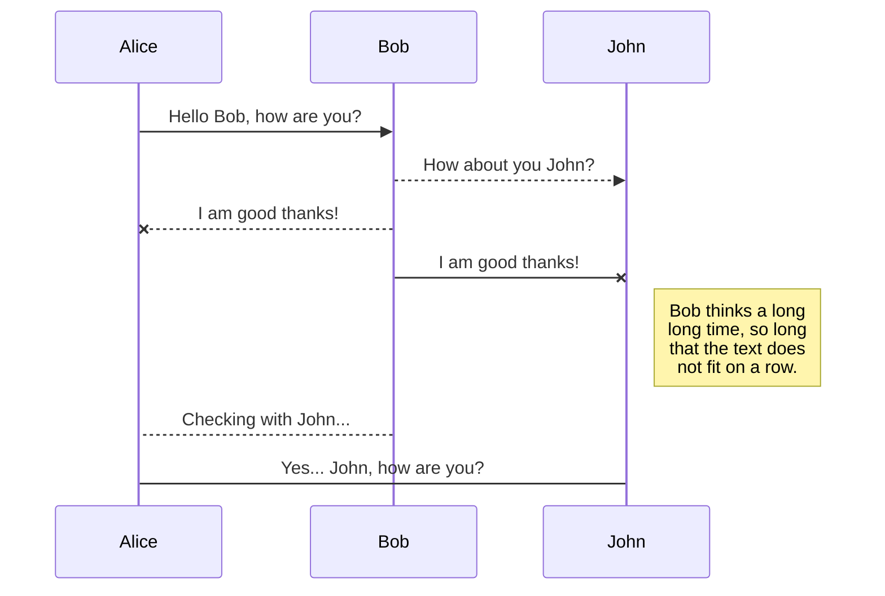
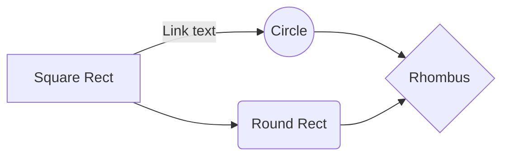

# 本周任务:

**1.确定每周固定会议时间，我建议周四下午3点-7点，我每周订图书馆的空会议室**

**2.确定我们要用什么数据库大致做什么**

## GitHub

所有内容均发布在Github上，方便fork其他项目，也方便大家以后把这部分加入自己的简历，熟悉版本管理器

## 简要说明
1.起始的出发点尽量选范围小一点的方向入手，如果一开始就设计了一个很宏大的架构，可能没有那么多的时间和精力来一步一步实现，反过来，一开始我们选择一个很窄的小点入手，随着项目的推进，不断加入新的features，这样比较可控。

2.希望整个大的项目能拆分出来一些部分使用没门课上能学到的东西，一来可以把项目拆分出来作为某一门课的Final Project，二来可以向当值老师咨询。

3.起始的topic选择有如下几个来源Github(Google),自己手爬，动手学习深度学习（一本书，里面有很多code），

4.希望尝试的方向：click rate

5.可以使用的工具：MangoDB / HBase / Spark Hadoop / Tenserflow Pytorch 

6.流程：
感觉我们找到数据后可以先用不同的异常值检测算法（随机森林，oneclassSVM）跑一下，看不同算法结果。
可以看看不同变量缺失值的相关性；对缺失值和预测目标做下卡方检验；对不同算法找的异常值和预测目标做卡方检验。这一步可以找business implication。关键是为什么有异常值和缺失值，异常值和缺失值出现是因为噪声还是有很深的business implication

之后可以试试不同降维方法（LLE，tsne，自编码器，玻尔兹曼机，embedding算法）的效果，降维做可视化。这一步也可以找business implication。也能决定类别变量的编码方法，是直接用粗暴的one hot，还是用一些embedding方法转为向量

后期有几个方向

第一个方向是走深度模型路线，先用迁移学习，元学习pretrain，决定架构；后期用explainable ML，lime，生成模型做模型解释

第二个方向是传统路线，找特征，对提取的特征做预测

估计会有几个需要解决的问题：稀疏矩阵编码（不同包的稀疏矩阵可能接口不同），有哪些部分是可以放到云上的，哪些是可以并行的，如何切分数据

## Data Source
|   source   | descripton |
|------------------------------------------------------------------|---------------------------|
|[https://www.blog.google/technology/research/open-source-and-open-data/] 	| open source 声明|
| [https://research.google/research-areas/data-mining-and-modeling/] 		| asdfsd|
|http://mmlab.ie.cuhk.edu.hk/projects/CelebA.html/ https://github.com/carpedm20/BEGAN-tensorflow| 面部识别图片库在googledrive上有|
|https://research.google/tools/datasets/					|Google公开数据库|
|https://github.com/google-research/bert					| NLP 类似于翻译，需要仔细研读|
|https://github.com/facundoolano/google-play-scraper				|Google player手动爬数据|
|https://ai.googleblog.com/search/label/Health					|google最新研究方向|
|https://research.google/teams/brain/						|Google ML团队页面|

Time Milestone
我们以周为单位来计算时间
|                |本周工作                        	  |完成进度                         |
|----------------|------------------------------|---------------------------|
|Feb 20		|确定选题，并且征询教授意见，看方向是否可行		 |'5%'        	   |
|Feb 27		|方向讨论和初步试验，一旦发现需要海量运算或者无法实现，及时调整方向  |	'`0%`        	   |
|March 5	|数据清洗，分任务		 |'0%'        	   |
|March 12	|试验不同模型和算法	|'0%'        	   |
|March 19	|模型建立，主体代码框架完成      	   		|'0%'        	   |
|March 26	| 调优，调参，酌情发布到Github上让其他人来看 		|'0%      	   |
|April 2	|验证排错     	 		 |0%          |
|April 9        |到此时间点，应该完成全部工作，留最后一点时间来进行可视化工作，给poster打印留出时间	 |0%       |
|April 23       |`-- is en-dash, --- is em-dash			`|0%|

&nbsp;

&nbsp;

&nbsp;

&nbsp;

# Welcome to StackEdit!

Hi! I'm your first Markdown file in **StackEdit**. If you want to learn about StackEdit, you can read me. If you want to play with Markdown, you can edit me. Once you have finished with me, you can create new files by opening the **file explorer** on the left corner of the navigation bar.

# Files

StackEdit stores your files in your browser, which means all your files are automatically saved locally and are accessible **offline!**

## Create files and folders

The file explorer is accessible using the button in left corner of the navigation bar. You can create a new file by clicking the **New file** button in the file explorer. You can also create folders by clicking the **New folder** button.

## Switch to another file

All your files and folders are presented as a tree in the file explorer. You can switch from one to another by clicking a file in the tree.

## Rename a file

You can rename the current file by clicking the file name in the navigation bar or by clicking the **Rename** button in the file explorer.

## Delete a file

You can delete the current file by clicking the **Remove** button in the file explorer. The file will be moved into the **Trash** folder and automatically deleted after 7 days of inactivity.

## Export a file

You can export the current file by clicking **Export to disk** in the menu. You can choose to export the file as plain Markdown, as HTML using a Handlebars template or as a PDF.

# Synchronization

Synchronization is one of the biggest features of StackEdit. It enables you to synchronize any file in your workspace with other files stored in your **Google Drive**, your **Dropbox** and your **GitHub** accounts. This allows you to keep writing on other devices, collaborate with people you share the file with, integrate easily into your workflow... The synchronization mechanism takes place every minute in the background, downloading, merging, and uploading file modifications.

There are two types of synchronization and they can complement each other:

- The workspace synchronization will sync all your files, folders and settings automatically. This will allow you to fetch your workspace on any other device.
	> To start syncing your workspace, just sign in with Google in the menu.

- The file synchronization will keep one file of the workspace synced with one or multiple files in **Google Drive**, **Dropbox** or **GitHub**.
	> Before starting to sync files, you must link an account in the **Synchronize** sub-menu.

## Open a file

You can open a file from **Google Drive**, **Dropbox** or **GitHub** by opening the **Synchronize** sub-menu and clicking **Open from**. Once opened in the workspace, any modification in the file will be automatically synced.

## Save a file

You can save any file of the workspace to **Google Drive**, **Dropbox** or **GitHub** by opening the **Synchronize** sub-menu and clicking **Save on**. Even if a file in the workspace is already synced, you can save it to another location. StackEdit can sync one file with multiple locations and accounts.

## Synchronize a file

Once your file is linked to a synchronized location, StackEdit will periodically synchronize it by downloading/uploading any modification. A merge will be performed if necessary and conflicts will be resolved.

If you just have modified your file and you want to force syncing, click the **Synchronize now** button in the navigation bar.

> **Note:** The **Synchronize now** button is disabled if you have no file to synchronize.

## Manage file synchronization

Since one file can be synced with multiple locations, you can list and manage synchronized locations by clicking **File synchronization** in the **Synchronize** sub-menu. This allows you to list and remove synchronized locations that are linked to your file.

# Publication

Publishing in StackEdit makes it simple for you to publish online your files. Once you're happy with a file, you can publish it to different hosting platforms like **Blogger**, **Dropbox**, **Gist**, **GitHub**, **Google Drive**, **WordPress** and **Zendesk**. With [Handlebars templates](http://handlebarsjs.com/), you have full control over what you export.

> Before starting to publish, you must link an account in the **Publish** sub-menu.

## Publish a File

You can publish your file by opening the **Publish** sub-menu and by clicking **Publish to**. For some locations, you can choose between the following formats:

- Markdown: publish the Markdown text on a website that can interpret it (**GitHub** for instance),
- HTML: publish the file converted to HTML via a Handlebars template (on a blog for example).

## Update a publication

After publishing, StackEdit keeps your file linked to that publication which makes it easy for you to re-publish it. Once you have modified your file and you want to update your publication, click on the **Publish now** button in the navigation bar.

> **Note:** The **Publish now** button is disabled if your file has not been published yet.

## Manage file publication

Since one file can be published to multiple locations, you can list and manage publish locations by clicking **File publication** in the **Publish** sub-menu. This allows you to list and remove publication locations that are linked to your file.

# Markdown extensions

StackEdit extends the standard Markdown syntax by adding extra **Markdown extensions**, providing you with some nice features.

> **ProTip:** You can disable any **Markdown extension** in the **File properties** dialog.

## SmartyPants

SmartyPants converts ASCII punctuation characters into "smart" typographic punctuation HTML entities. For example:

|                |ASCII                          |HTML                         |
|----------------|-------------------------------|-----------------------------|
|Single backticks|`'Isn't this fun?'`            |'Isn't this fun?'            |
|Quotes          |`"Isn't this fun?"`            |"Isn't this fun?"            |
|Dashes          |`-- is en-dash, --- is em-dash`|-- is en-dash, --- is em-dash|

## KaTeX

You can render LaTeX mathematical expressions using [KaTeX](https://khan.github.io/KaTeX/):

The *Gamma function* satisfying $\Gamma(n) = (n-1)!\quad\forall n\in\mathbb N$ is via the Euler integral

$$
\Gamma(z) = \int_0^\infty t^{z-1}e^{-t}dt\,.
$$

> You can find more information about **LaTeX** mathematical expressions [here](http://meta.math.stackexchange.com/questions/5020/mathjax-basic-tutorial-and-quick-reference).

## UML diagrams

You can render UML diagrams using [Mermaid](https://mermaidjs.github.io/). For example, this will produce a sequence diagram:

And this will produce a flow chart:

